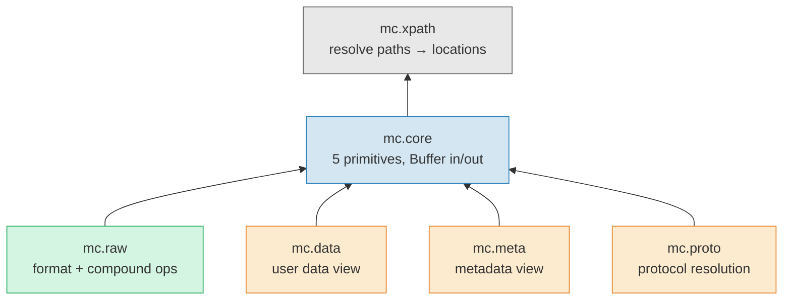
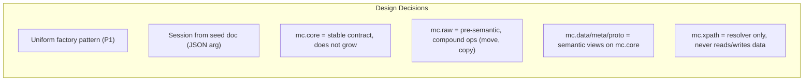
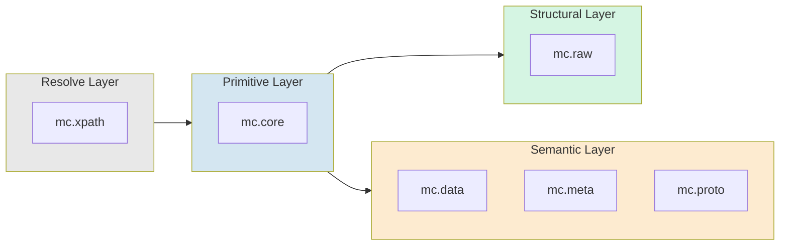
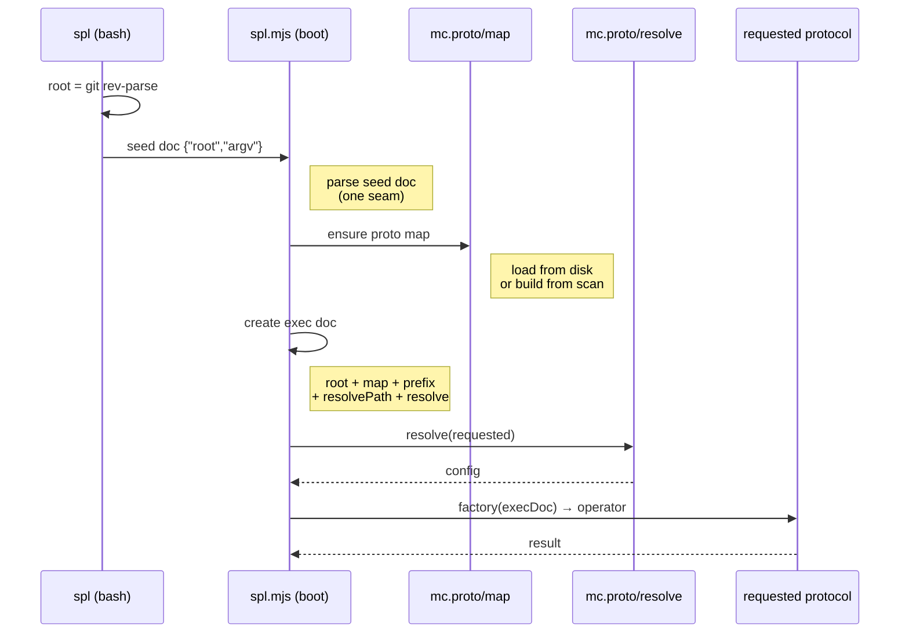
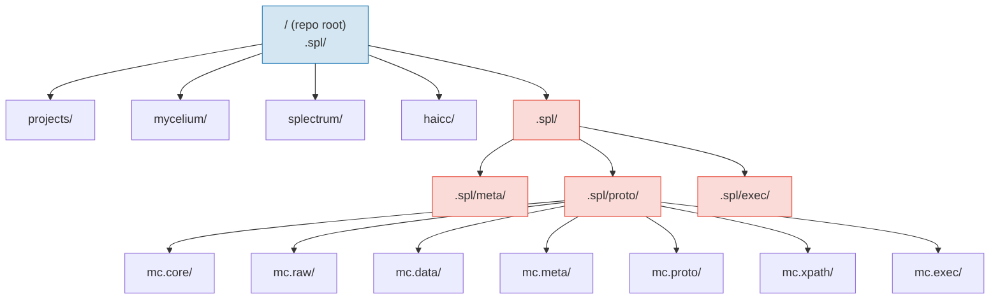
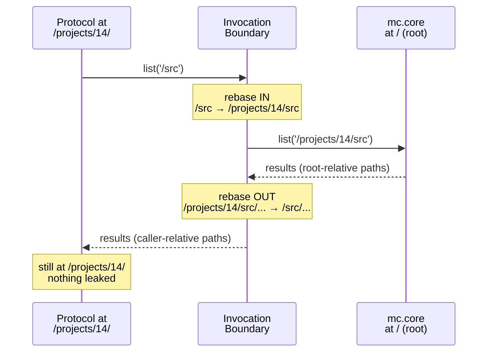
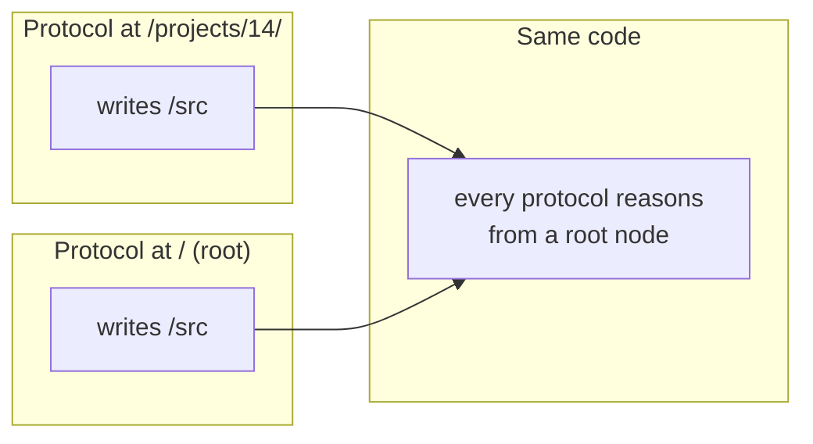
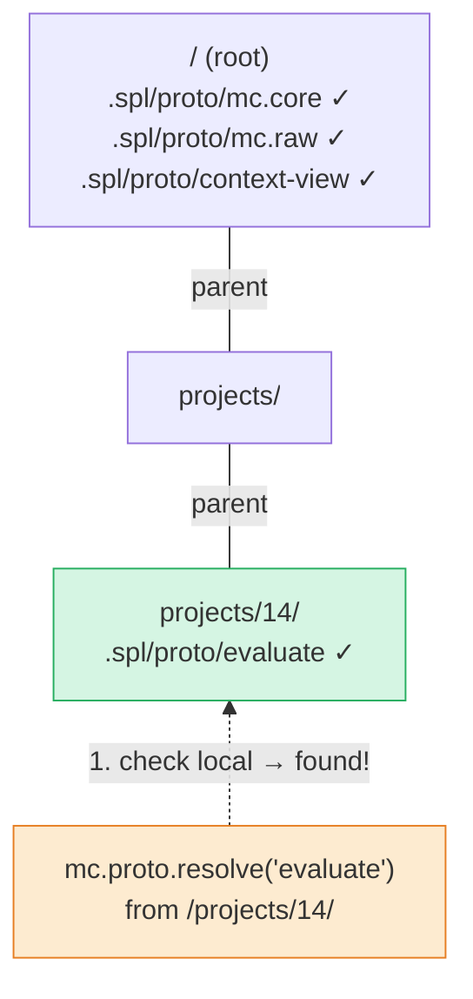
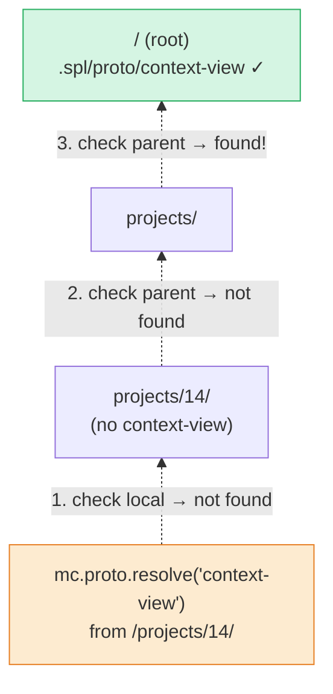

# Diagrams

Visual companion to the model documents. All diagrams
use Mermaid for GitHub rendering.

## Protocol Stack

Dependencies between protocols and the design decisions
that shaped each one.

### Protocol Responsibilities

## Bootstrap Sequence

How the system starts. Seed doc is the one seam,
then protocols all the way down.

## Context Hierarchy

The repository as a Mycelium context tree. Every
directory with `.spl/` is a context.

**Blue** = context root. **Red** = .spl namespace
(metadata, not user data). mc.data filters red
from list results.

## Scope Isolation (Designed)

How path rebasing works at protocol invocation
boundaries. Not yet implemented.

### Design Invariant

## Ancestor Chain Resolution (Designed)

How mc.proto.resolve finds protocols. Walk up from
current context. Nearest distance wins.

Currently implemented as map-based lookup with longest
prefix match (equivalent behavior).

- **Static** = found at invocation context (evaluate at /projects/14/)
- **Dynamic** = found via ancestor walk (context-view from root)
